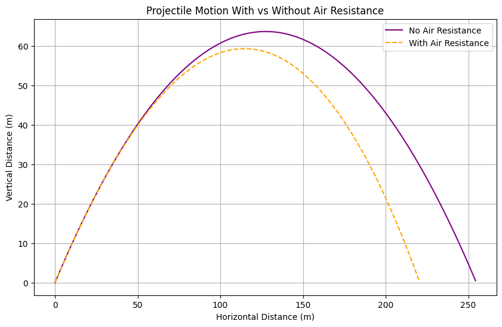
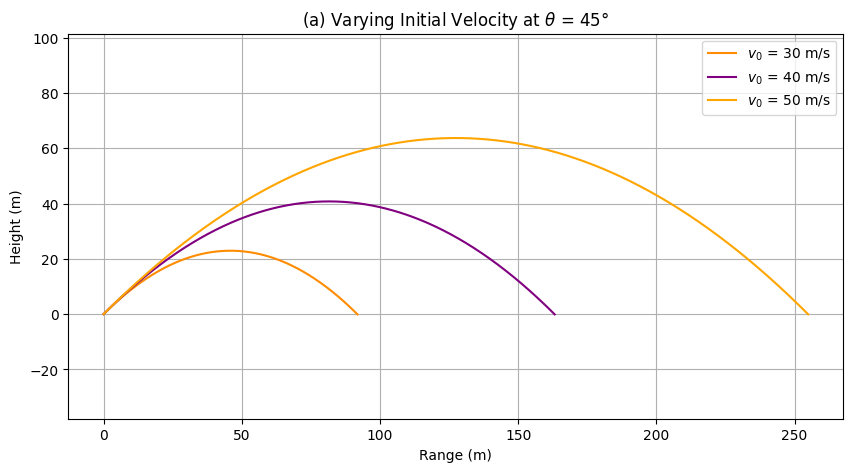
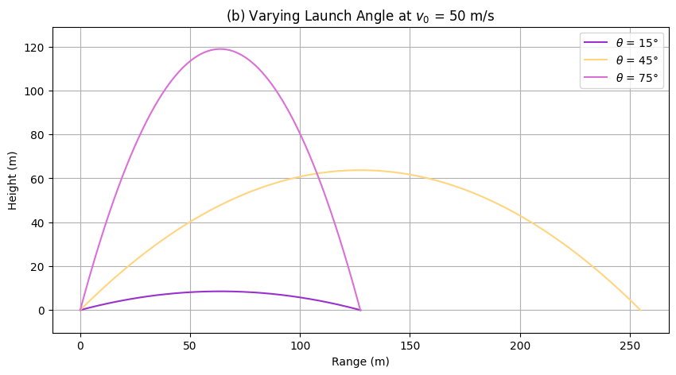
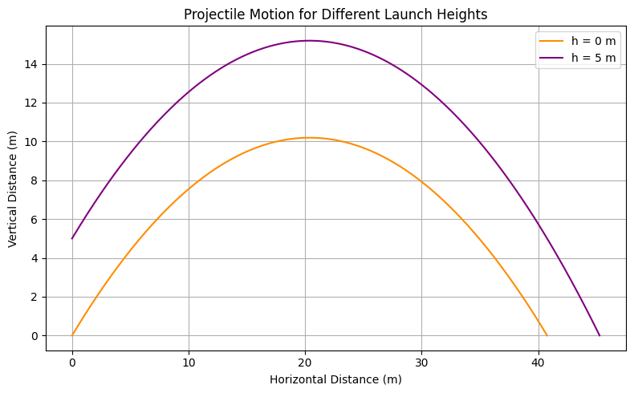

## Problem 1: Investigating the Range as a Function of Launch Angle

---

### Motivation

Projectile motion is a classic physics topic that helps explain the motion of objects under gravity. Our goal is to understand **how the range of a projectile depends on the launch angle**, both:

- analytically (with equations)
- and numerically (via Python simulations)

We’ll start with no air resistance and gradually introduce more realistic effects like **air drag**, **wind**, and **numerical simulation techniques**.

---

###  1. Differential Equations of Motion

####  Without Air Resistance

We apply Newton’s Second Law:

$$
\vec{F} = m\vec{a}
$$

## 2. Numerical Solution (With Air Resistance)

**Drag Force:** $\vec{F}_{drag} = -k\vec{v}$

- Horizontal direction:
  $$
  \frac{d^2x}{dt^2} = 0 \quad \Rightarrow \quad \frac{dx}{dt} = v_0 \cos(\theta)
  $$
- Vertical direction:
  $$
  \frac{d^2y}{dt^2} = -g \quad \Rightarrow \quad \frac{dy}{dt} = v_0 \sin(\theta) - gt
  $$

---

###  With Air Resistance (Linear Drag)

Air drag is modeled as a force proportional to velocity:

$$
\vec{F}_{\text{drag}} = -k \vec{v}
$$

#### - Horizontal direction:

$$
\frac{dv_x}{dt} = -k v_x
$$

#### - Vertical direction:

$$
\frac{dv_y}{dt} = -g - k v_y
$$

These are **first-order differential equations** that generally require numerical methods (like Euler’s or Runge-Kutta) to solve.




---

## 2. Kinematic Equations

For a projectile launched from height $h$, initial speed $v_0$, and angle $\theta$, the motion can be described by:


- **Horizontal displacement**:
  $$
  x(t) = v_0 \cos(\theta) \cdot t
  $$

- **Vertical displacement**:
  $$
  y(t) = h + v_0 \sin(\theta) \cdot t - \frac{1}{2} g t^2
  $$

- **Horizontal velocity**:
  $$
  v_x = v_0 \cos(\theta)
  $$

- **Vertical velocity**:
  $$
  v_y(t) = v_0 \sin(\theta) - g t
  $$

- **Speed at time \( t \)**:
  $$
  v(t) = \sqrt{v_x^2 + v_y(t)^2}
  $$

Where:
- $g$ is the acceleration due to gravity (typically $9.81 \, \text{m/s}^2$),
- $t$ is the time elapsed,
- $x(t)$ and $y(t)$ are the positions at time $t$,
- $v_x$, $v_y(t)$ are the velocity components.


- Horizontal position:
  $$
  x(t) = v_0 \cos(\theta) \cdot t
  $$

- Vertical position:
  $$
  y(t) = h + v_0 \sin(\theta) \cdot t - \frac{1}{2}gt^2
  $$

---

## ⏱ 3. Time of Flight 

We want to find the total time \( t \) the projectile stays in the air.

Set the vertical position \( y(t) = 0 \) to find when the projectile returns to ground level.

From the kinematic equation:
$$
y(t) = h + v_0 \sin(\theta)t - \frac{1}{2}gt^2
$$

Set \( y(t) = 0 \):
$$
0 = h + v_0 \sin(\theta)t - \frac{1}{2}gt^2
$$

This is a quadratic equation in \( t \):
$$
\frac{1}{2}gt^2 - v_0 \sin(\theta)t - h = 0
$$


Solve using the quadratic formula:
$$
t = \frac{v_0 \sin(\theta) + \sqrt{(v_0 \sin(\theta))^2 + 2gh}}{g}
$$

 **Note:** We discard the negative root since time cannot be negative.

---

##  4. Range of the Projectile

The **range** is the horizontal distance when \( y = 0 \):

$$
R = v_0 \cos(\theta) \cdot t
$$

If \( h = 0 \), simplifies to:

$$
R = \frac{v_0^2 \sin(2\theta)}{g}
$$

| ||
|:-------------------------:|:-------------------------:|


**Insight**: Maximum range occurs when 

$$
\theta = 45^\circ
$$

```python
import numpy as np
import matplotlib.pyplot as plt

# Constants
g = 9.81  # gravity (m/s^2)

# Function to generate projectile motion
def projectile_motion(v0, theta_deg, h=0, dt=0.01):
    theta = np.radians(theta_deg)
    vx = v0 * np.cos(theta)
    vy = v0 * np.sin(theta)
    
    x, y = [0], [h]
    t = 0
    while y[-1] >= 0:
        t += dt
        x.append(vx * t)
        y.append(h + vy * t - 0.5 * g * t**2)
    return x, y

# -------- Plot (a): Varying Initial Velocity, θ = 45° --------
v0_list = [30, 40, 50]
theta_fixed = 45

plt.figure(figsize=(10, 5))
for v0 in v0_list:
    x, y = projectile_motion(v0, theta_fixed)
    plt.plot(x, y, label=f'$v_0$ = {v0} m/s')

plt.title('(a) Varying Initial Velocity at $\\theta$ = 45°')
plt.xlabel('Range (m)')
plt.ylabel('Height (m)')
plt.grid(True)
plt.legend()
plt.axis('equal')
plt.show()

# -------- Plot (b): Varying Angle, v0 = 50 m/s --------
theta_list = [15, 45, 75]
v0_fixed = 50

plt.figure(figsize=(10, 5))
for theta in theta_list:
    x, y = projectile_motion(v0_fixed, theta)
    plt.plot(x, y, label=f'$\\theta$ = {theta}°')

plt.title('(b) Varying Launch Angle at $v_0$ = 50 m/s')
plt.xlabel('Range (m)')
plt.ylabel('Height (m)')
plt.grid(True)
plt.legend()
plt.axis('equal')
plt.show()
```
## **5. Example Calculations**

### **Example 1: Finding the Maximum Range**
If $v_0 = 20$ m/s and $h=0$,

$$ R = \frac{20^2 \sin(2 \times 45^\circ)}{9.81} \approx 40.8 \text{ m} $$

### **Example 2: Effect of Launch Height**
If $v_0 = 20$ m/s and $h=5$ m,

Using the general range formula, we get:

$$ R \approx 45.2 \text{ m} $$



