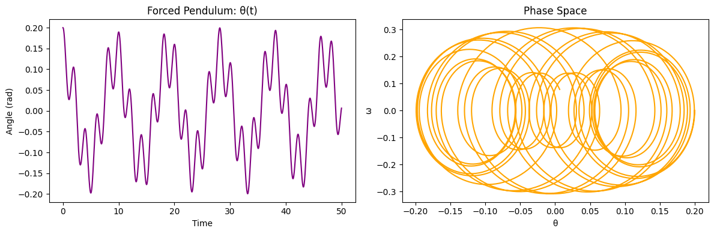

# Problem 1

# Investigating the Range as a Function of the Angle of Projection

## 1. Theoretical Foundation

### Understanding Projectile Motion
Projectile motion occurs when an object is launched into the air and moves under the influence of gravity alone. This type of motion can be broken into two independent components:
- **Horizontal motion**: The projectile moves at a constant velocity because there are no forces acting in the horizontal direction (ignoring air resistance).
- **Vertical motion**: The projectile is influenced by gravity, which causes it to decelerate on the way up and accelerate on the way down.

### Key Equations of Motion
The basic kinematic equations govern the motion:

- **Horizontal position** (constant velocity):
  $$ x = v_0 \cos(\theta) t $$
- **Vertical position** (accelerated motion due to gravity):
  $$ y = v_0 \sin(\theta) t - \frac{1}{2} g t^2 $$

### Step-by-Step Derivation of Range
1. **Find the total time of flight**:
   The projectile reaches the ground when \( y = 0 \), solving for \( t \):
   $$ t_f = \frac{2 v_0 \sin(\theta)}{g} $$
   This is the total time the projectile spends in the air.

2. **Find the range formula**:
   The range is the total horizontal distance covered before landing:
   $$ R = v_0 \cos(\theta) \cdot t_f $$
   Substituting \( t_f \):
   $$ R = \frac{v_0^2 \sin(2\theta)}{g} $$

3. **Maximum Range Condition**:
   - The range is maximized when \( \sin(2\theta) \) is at its maximum value (which is 1, occurring at \( 2\theta = 90^\circ \)).
   - Therefore, the optimal angle for maximum range is:
   $$ \theta = 45^\circ $$

---

## 2. Computational Simulation

The following Python script simulates how the range varies with different launch angles:



```python
import numpy as np
import matplotlib.pyplot as plt

# Constants
g = 9.81  # Acceleration due to gravity (m/s^2)
v0 = 20   # Initial velocity (m/s)
angles = np.linspace(0, 90, num=100)  # Angles from 0 to 90 degrees

# Convert angles to radians
theta = np.radians(angles)

# Compute range using the formula R = (v0^2 * sin(2*theta)) / g
ranges = (v0**2 * np.sin(2 * theta)) / g

# Plot range as a function of the launch angle
plt.figure(figsize=(8, 5))
plt.plot(angles, ranges, label=f'Initial velocity = {v0} m/s')
plt.xlabel('Angle of Projection (degrees)')
plt.ylabel('Range (m)')
plt.title('Projectile Range vs. Angle of Projection')
plt.legend()
plt.grid()
plt.show()
```

---

## 3. Practical Applications

1. **Sports**: Understanding projectile motion helps optimize throwing angles in sports like javelin, soccer, and basketball.
2. **Engineering**: Trajectory calculations are essential in ballistics and aerospace engineering.
3. **Military & Defense**: Calculating precise launch angles for missiles or artillery shells is crucial.
4. **Real-World Factors**: In actual scenarios, air resistance, wind, and terrain variations influence the motion.

---

## 4. Limitations of the Ideal Model

- **No Air Resistance**: The equations assume no drag force, but in reality, air resistance can significantly alter the motion.
- **Uniform Gravity**: The model assumes gravity is constant, but for long-range projectiles, gravity varies slightly with altitude.
- **Flat Terrain**: The derivation assumes the projectile lands at the same height it was launched from. Uneven ground requires adjustments.

**Extensions:**
- Including air resistance using numerical methods.
- Analyzing projectile motion on non-level surfaces.
- Considering wind effects and varying gravitational acceleration for high-altitude or long-range motion.
```
