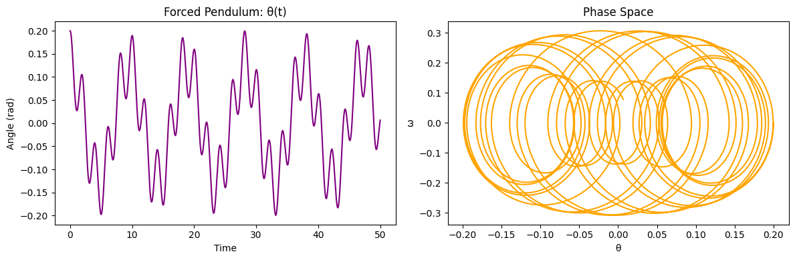

#  Problem 2:
 ### Investigating the Dynamics of a Forced Damped Pendulum

The **forced damped pendulum** is a classical nonlinear system governed by the interplay of restoring forces (gravity), damping (resistance), and external periodic driving. Its rich dynamics include:

- Simple harmonic motion
- Resonance
- Chaos
- Quasiperiodicity

This system serves as a model for:
- Oscillating circuits (RLC)
- Mechanical vibration systems
- Energy harvesting devices
- Climate and biological rhythms

---

##  Theoretical Background

### Governing Differential Equation

The general form is:

$$
\frac{d^2\theta}{dt^2} + b\frac{d\theta}{dt} + \frac{g}{L} \sin\theta = A \cos(\omega t)
$$

**Where:**
- $\theta(t)$: angular displacement  
- $b$: damping coefficient  
- $\frac{g}{L}$: restoring term (natural frequency squared)  
- $A$: amplitude of driving force  
- $\omega$: angular frequency of the external drive  

---

###  Small-Angle Approximation

When $\theta \ll 1$, we can approximate:

$$
\sin\theta \approx \theta
$$

Resulting in a linearized version:

$$
\frac{d^2\theta}{dt^2} + b\frac{d\theta}{dt} + \frac{g}{L} \theta = A \cos(\omega t)
$$

---

###  Useful Definitions

- **Natural Frequency:**
  $$
  \omega_0 = \sqrt{\frac{g}{L}}
  $$
- **Damping Ratio:**
  $$
  \zeta = \frac{b}{2\sqrt{g/L}}
  $$
  **Resonance:** occurs when $\omega \approx \omega_0$, which leads to large amplitude oscillations.

---

## Example (Small-Angle, Linear Case)

###  Given:

- $L = 1 \, \text{m}, \quad g = 9.8 \, \text{m/s}^2$
- $b = 0.5, \quad A = 1.2, \quad \omega = 2.0$
- Initial Conditions: $\theta(0) = 0.2 \, \text{rad}, \quad \dot{\theta}(0) = 0$

The simplified equation becomes:

$$
\frac{d^2\theta}{dt^2} + 0.5 \frac{d\theta}{dt} + 9.8 \theta = 1.2 \cos(2t)
$$

This has no analytical closed-form solution in the general case, so we proceed to solve it numerically.

---

#  Python Simulation (Visualize in Colab)

### SIMPLE PENDULUM 

### DAMPED PENDULUM

### FORCED PENDULUM (No Damping)

### FORCED DAMPED PENDULUM

### CHAOTIC / RESONANT PENDULUM 

----
[Open in Colab](https://colab.research.google.com/drive/1qWY-0tRAaNqDoGkIPwVe10uU-DeyS-Uq#scrollTo=fXE-n0q8vLo9)
