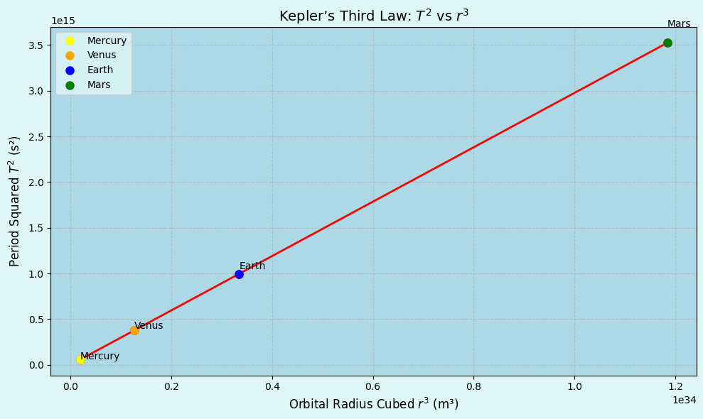

# Problem 1
# Orbital Period and Orbital Radius

The relationship between the square of the orbital period and the cube of the orbital radius, known as **Kepler's Third Law**, is a cornerstone of celestial mechanics. This simple yet profound relationship allows for the determination of planetary motions and has implications for understanding gravitational interactions on both local and cosmic scales. By analyzing this relationship, one can connect fundamental principles of gravity with real-world phenomena such as satellite orbits and planetary systems.

---

## 1. Derivation of Kepler's Third Law

We begin with Newton's Law of Universal Gravitation:

$$
F_{\text{gravity}} = \frac{G M m}{r^2}
$$

And the formula for centripetal force required to maintain a circular orbit:

$$
F_{\text{centripetal}} = \frac{m v^2}{r}
$$

Equating both forces:

$$
\frac{G M m}{r^2} = \frac{m v^2}{r}
$$

Solving for orbital speed \( v \):

$$
v = \sqrt{\frac{G M}{r}}
$$

Now, the orbital period \( T \) is the time to complete one full orbit:

$$
T = \frac{2\pi r}{v}
$$

Substitute \( v \):

$$
T = \frac{2\pi r}{\sqrt{\frac{G M}{r}}} = 2\pi \sqrt{\frac{r^3}{G M}}
$$

Square both sides:

$$
T^2 = \frac{4\pi^2}{G M} \cdot r^3
$$

This is **Kepler’s Third Law** for circular orbits:

$$
T^2 \propto r^3
$$

---

## 2. Astronomical Implications

Kepler's Third Law has practical applications in astronomy:

- **Determining planetary masses**:

  $$
  M = \frac{4\pi^2 r^3}{G T^2}
  $$

- **Predicting satellite orbits** around planets.
- **Estimating distances** of exoplanets from their stars by observing orbital periods.

---

## 3. Real-World Examples

### a. The Moon Orbiting the Earth

**Given:**

- Orbital radius:  
  $$
  r = 3.84 \times 10^8 \, \text{m}
  $$

- Orbital period:  
  $$
  T = 27.3 \, \text{days} = 2.36 \times 10^6 \, \text{s}
  $$

**Now verify the relation:**

$$
\frac{r^3}{T^2} \approx \text{constant}
$$

**Calculation:**

$$
\frac{(3.84 \times 10^8)^3}{(2.36 \times 10^6)^2} \approx 4.92 \times 10^{13} \, \text{m}^3/\text{s}^2
$$

This value is consistent with Earth's gravitational parameter:

$$
GM = 3.986 \times 10^{14} \, \text{m}^3/\text{s}^2
$$

when the constant  
$$
\frac{4\pi^2}{GM}
$$  
is included.

---

### b. Planets in the Solar System

Using Earth, Mars, and Jupiter as examples, we can compare:

$$
\frac{T^2}{r^3} \approx \text{same constant for each planet}
$$

Which confirms Kepler’s Third Law on a solar system scale.

---
[Colab Link For Plots](https://colab.research.google.com/drive/1oJIgQAWN5WBpZEPSukw1fkTnO9O2l9qL?usp=sharing)