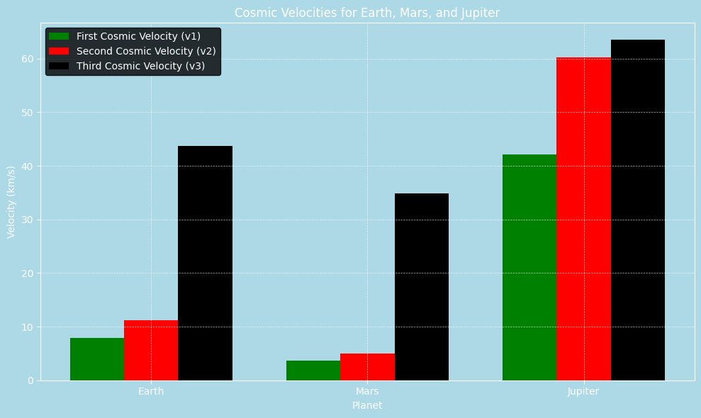

# Problem 2

#  Cosmic Velocities and Escape Velocities

##  Definitions and Concepts

### First Cosmic Velocity ($v_1$)
The minimum velocity an object must have to enter a stable circular orbit just above the surface of a celestial body.

$$
v_1 = \sqrt{\frac{GM}{R}}
$$

- $G$: Universal gravitational constant ($6.674 \times 10^{-11}\,\text{m}^3\text{kg}^{-1}\text{s}^{-2}$)
- $M$: Mass of the celestial body
- $R$: Radius of the celestial body

---

### Second Cosmic Velocity ($v_2$) - Escape Velocity
The velocity required to completely overcome a planet's gravitational pull without further propulsion.

$$
v_2 = \sqrt{2} \cdot v_1 = \sqrt{\frac{2GM}{R}}
$$

---

### Third Cosmic Velocity ($v_3$)
The velocity required to escape the gravitational influence of the Sun from the orbit of the planet.

Approximate (from Earth’s orbit):
$$
v_3 = \sqrt{2} \cdot v_\text{orbital Earth} \approx 42.1 \, \text{km/s}
$$

More precisely:
$$
v_3 = \sqrt{v_\text{planet}^2 + v_2^2}
$$

---

##  Example: Earth

- $M_\text{Earth} = 5.972 \times 10^{24}\,\text{kg}$
- $R_\text{Earth} = 6.371 \times 10^6\,\text{m}$

### Calculations

#### First Cosmic Velocity (Low Earth Orbit):
$$
v_1 = \sqrt{\frac{6.674 \times 10^{-11} \cdot 5.972 \times 10^{24}}{6.371 \times 10^6}} \approx 7.91\,\text{km/s}
$$

#### Second Cosmic Velocity:
$$
v_2 = \sqrt{2} \cdot 7.91 \approx 11.2\,\text{km/s}
$$

#### Third Cosmic Velocity (to leave solar system from Earth orbit):
$$
v_3 \approx 42.1\,\text{km/s}
$$

---

##  Mars and Jupiter (Summary Table)

| Planet  | Radius (km) | Mass ($kg$)        | $v_1$ (km/s) | $v_2$ (km/s) |
|---------|-------------|---------------------|--------------|--------------|
| Earth   | 6371        | $5.972 \times 10^{24}$ | 7.91         | 11.2         |
| Mars    | 3389        | $6.417 \times 10^{23}$ | 3.55         | 5.0          |
| Jupiter | 69911       | $1.898 \times 10^{27}$ | 42.1         | 59.5         |

---

##  Visualizations 

The notebook will include:
- Graphs of $v_1$, $v_2$ across different planets
- Interactive sliders 
- Comparison plots

[Slider Link + Colab](https://colab.research.google.com/drive/1v6DWySxLkirMVefpGA-SgnkiE9aJqdfZ?usp=sharing)

---

## Importance in Space Exploration

- **$v_1$**: Used for satellites in low Earth orbit (LEO)
- **$v_2$**: Required for missions to Moon, Mars, etc.
- **$v_3$**: Interstellar probes like *Voyager 1* needed to exceed this

---

