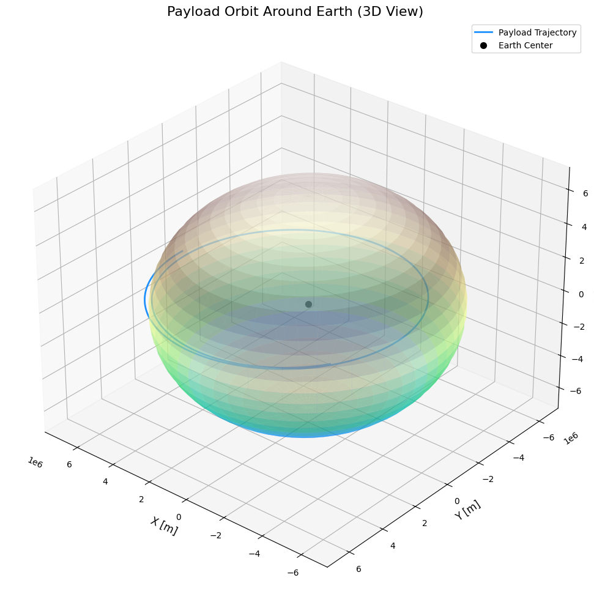
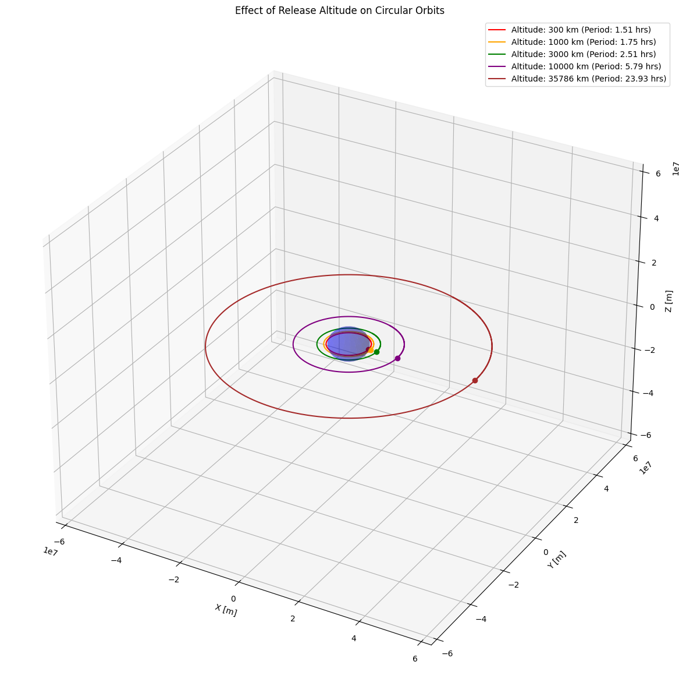
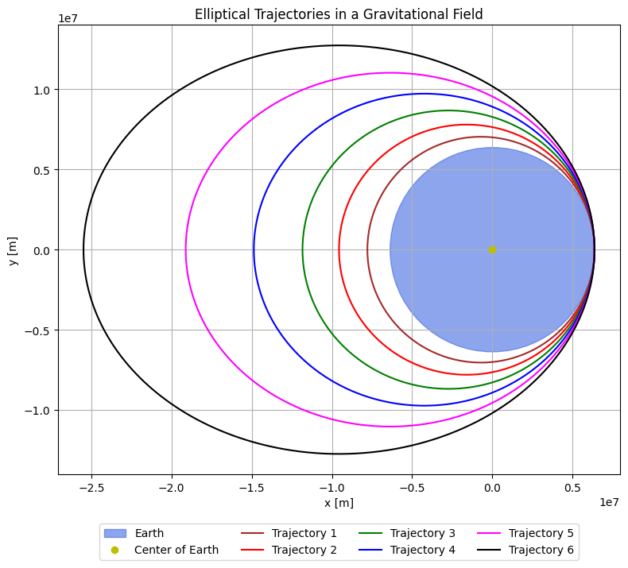
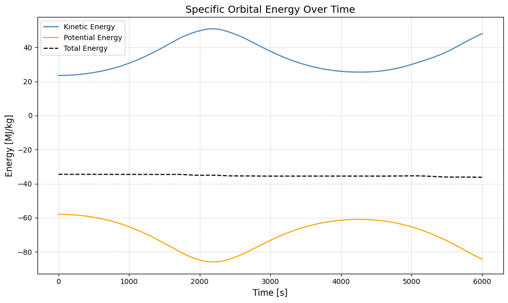
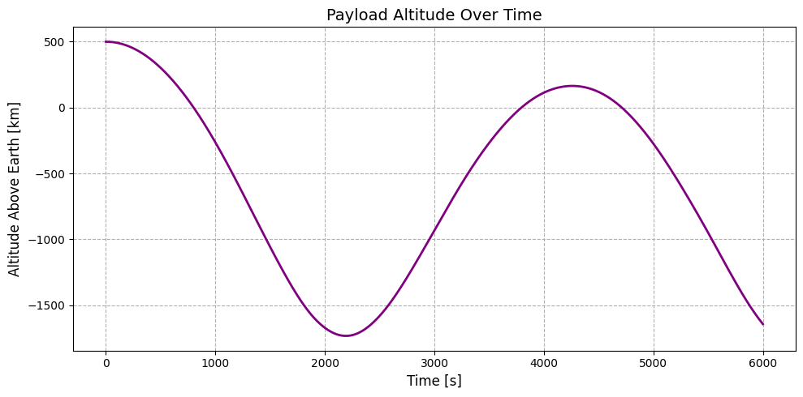

# Problem 3
# Trajectories of a Freely Released Payload Near Earth

## Table of Contents
1. [Introduction](#introduction)
2. [Theoretical Background](#theoretical-background)
   - [Newton's Law of Gravitation](#newtons-law-of-gravitation)
   - [Kepler's Laws](#keplers-laws)
   - [Types of Trajectories](#types-of-trajectories)
   - [Orbital Elements](#orbital-elements)
3. [Mathematical Formulation](#mathematical-formulation)
   - [Equations of Motion](#equations-of-motion)
   - [Initial Conditions](#initial-conditions)
   - [Numerical Integration Methods](#numerical-integration-methods)

4. [Visualization and Analysis](#visualization-and-analysis)
   - [Trajectory Visualization](#trajectory-visualization)
   - [Phase Space Analysis](#phase-space-analysis)
   - [Critical Parameters](#critical-parameters)
5. [Applications](#applications)
   - [Orbital Insertion](#orbital-insertion)
   - [Reentry Scenarios](#reentry-scenarios)
   - [Escape Trajectories](#escape-trajectories)
6. [Conclusion](#conclusion)
7. [References](#references)

## Introduction

When an object is released from a moving rocket near Earth, its subsequent trajectory is governed by a complex interplay of initial conditions and gravitational forces. Understanding these trajectories is fundamental to space mission planning, satellite deployment, and spacecraft operations.

This document explores the mathematical principles behind payload trajectories, implements numerical simulations using Python, and visualizes different trajectory scenarios based on varying initial conditions. We'll examine how slight changes in release parameters can result in dramatically different outcomes, from stable orbits to escape trajectories or atmospheric reentry.

## Theoretical Background

### Newton's Law of Gravitation

The foundation of orbital mechanics lies in Newton's Law of Universal Gravitation, which states that two bodies attract each other with a force proportional to the product of their masses and inversely proportional to the square of the distance between them:

$$F_g = G\frac{m_1 m_2}{r^2}$$

Where:
- $F_g$ is the gravitational force
- $G$ is the universal gravitational constant ($6.67430 \times 10^{-11} \text{ m}^3 \text{ kg}^{-1} \text{ s}^{-2}$)
- $m_1$ and $m_2$ are the masses of the two bodies
- $r$ is the distance between the centers of the two bodies

For a payload near Earth, this simplifies to:

$$\vec{F}_g = -\frac{GM_E m}{r^2} \hat{r}$$

Where:
- $M_E$ is Earth's mass ($5.97219 \times 10^{24} \text{ kg}$)
- $m$ is the payload mass
- $r$ is the distance from Earth's center
- $\hat{r}$ is the unit vector pointing from Earth to the payload

### Kepler's Laws

Kepler's laws describe the motion of objects under gravitational influence:

1. **First Law**: The orbit of a planet is an ellipse with the Sun at one of the two foci.
2. **Second Law**: A line segment joining a planet and the Sun sweeps out equal areas during equal intervals of time.
3. **Third Law**: The square of the orbital period is proportional to the cube of the semi-major axis of the orbit.

For a payload near Earth, these laws apply with Earth as the central body.

### Types of Trajectories

Depending on the payload's energy at release, its trajectory will fall into one of these categories:

1. **Circular Orbit**: When the velocity is exactly equal to the circular orbital velocity at that altitude.
   - $v_{\text{circular}} = \sqrt{\frac{GM_E}{r}}$

2. **Elliptical Orbit**: When the velocity is less than escape velocity but not equal to circular velocity.
   - Characterized by $0 < e < 1$ where $e$ is eccentricity

3. **Parabolic Trajectory**: When the velocity equals escape velocity.
   - $v_{\text{escape}} = \sqrt{\frac{2GM_E}{r}}$
   - Characterized by $e = 1$

4. **Hyperbolic Trajectory**: When the velocity exceeds escape velocity.
   - Characterized by $e > 1$

5. **Sub-orbital Trajectory**: When the velocity is insufficient to maintain orbit and the payload will return to Earth's atmosphere.

### Orbital Elements

To fully describe an orbit, we use these key orbital elements:

- **Semi-major axis** ($a$): Half of the longest diameter of the elliptical orbit
- **Eccentricity** ($e$): Measure of how much the orbit deviates from a circle
- **Inclination** ($i$): Angle between the orbital plane and reference plane
- **Longitude of the ascending node** ($\Omega$): Angle between reference direction and ascending node
- **Argument of periapsis** ($\omega$): Angle between ascending node and periapsis
- **True anomaly** ($\nu$): Angle between periapsis and current position

## Mathematical Formulation

### Equations of Motion

The motion of a payload in Earth's gravitational field is described by the following differential equations:

$$\frac{d^2\vec{r}}{dt^2} = -\frac{GM_E}{r^3}\vec{r}$$

In Cartesian coordinates:

$$\frac{d^2x}{dt^2} = -\frac{GM_E x}{(x^2 + y^2 + z^2)^{3/2}}$$

$$\frac{d^2y}{dt^2} = -\frac{GM_E y}{(x^2 + y^2 + z^2)^{3/2}}$$

$$\frac{d^2z}{dt^2} = -\frac{GM_E z}{(x^2 + y^2 + z^2)^{3/2}}$$

### Initial Conditions

To solve these equations, we need initial conditions:
- Initial position vector: $\vec{r}_0 = (x_0, y_0, z_0)$
- Initial velocity vector: $\vec{v}_0 = (v_{x0}, v_{y0}, v_{z0})$

The specific energy of the orbit is given by:

$$\varepsilon = \frac{v^2}{2} - \frac{GM_E}{r}$$

This energy determines the type of trajectory:
- $\varepsilon < 0$: Elliptical orbit
- $\varepsilon = 0$: Parabolic trajectory
- $\varepsilon > 0$: Hyperbolic trajectory

### Numerical Integration Methods

For precise trajectory calculations, we'll use numerical integration methods. The most common are:

1. **Euler Method**: Simple but less accurate
   $$\vec{r}_{n+1} = \vec{r}_n + \vec{v}_n \Delta t$$
   $$\vec{v}_{n+1} = \vec{v}_n + \vec{a}_n \Delta t$$

2. **Runge-Kutta 4th Order Method**: Higher accuracy
   $$\vec{r}_{n+1} = \vec{r}_n + \frac{1}{6}(k_1 + 2k_2 + 2k_3 + k_4)$$
   where $k_1, k_2, k_3, k_4$ are intermediate calculations

3. **Verlet Integration**: Better energy conservation
   $$\vec{r}_{n+1} = 2\vec{r}_n - \vec{r}_{n-1} + \vec{a}_n \Delta t^2$$

We'll implement the RK4 method for our simulations due to its balance of accuracy and computational efficiency.

## Visualization and Analysis

### Trajectory Visualization

The visualizations created by our Python code provide insights into how initial conditions affect the resulting trajectories. The 3D plots show:

1. The spatial path of the payload relative to Earth
2. The shape and orientation of the orbit
3. How changes in initial velocity transform orbit types

The animations further enhance understanding by showing the dynamic nature of orbital motion, including:
- Varying orbital speeds at different points in elliptical orbits (Kepler's Second Law)
- Escape trajectories that never return
- Sub-orbital paths that intersect Earth's surface

### Phase Space Analysis

The phase space diagrams illustrate the relationship between:
- Initial velocity and resulting eccentricity
- Initial velocity and specific orbital energy
- The critical thresholds that separate different trajectory types

These visualizations help identify the narrow "windows" for specific mission requirements, such as:
- Circular orbit insertion
- Achieving specific orbital periods
- Minimum velocity requirements for escape trajectories

### Critical Parameters

Several key parameters determine the trajectory type:

1. **Specific Orbital Energy (ε)**:
   $\varepsilon = \frac{v^2}{2} - \frac{\mu}{r}$
   Where $\mu = GM_E$. This energy remains constant throughout the orbit and determines whether the orbit is bound (elliptical) or unbound (hyperbolic).

2. **Angular Momentum (h)**:
   $\vec{h} = \vec{r} \times \vec{v}$
   This vector is perpendicular to the orbital plane and remains constant in the absence of external torques.

3. **Eccentricity (e)**:
   $\vec{e} = \frac{\vec{v} \times \vec{h}}{\mu} - \frac{\vec{r}}{r}$
   The magnitude of this vector determines the orbit shape:
   - $e = 0$: Circular
   - $0 < e < 1$: Elliptical
   - $e = 1$: Parabolic
   - $e > 1$: Hyperbolic

4. **Critical Velocities**:
   - Circular velocity: $v_{\text{circular}} = \sqrt{\frac{\mu}{r}}$
   - Escape velocity: $v_{\text{escape}} = \sqrt{\frac{2\mu}{r}}$

Understanding these parameters is crucial for mission planning and payload deployment.

## Applications

### Orbital Insertion

For successful orbital insertion, a payload must achieve sufficient velocity in the correct direction. The process typically involves:

1. **Altitude Selection**: Higher altitudes require less velocity for orbit but more energy to reach.
2. **Velocity Requirements**: The payload must achieve at least circular velocity at the desired altitude.
3. **Direction Control**: The velocity vector must be perpendicular to the radius vector for a circular orbit.
4. **Timing of Release**: For specific orbital characteristics (e.g., sun-synchronous orbits), release timing is critical.

The minimum energy required for orbital insertion at altitude $h$ is:

$E_{\text{min}} = \frac{1}{2}m v_{\text{circular}}^2 = \frac{1}{2}m \frac{\mu}{R_E + h}$

Orbital insertion failures can result from:
- Insufficient velocity (resulting in suborbital trajectory)
- Incorrect direction (resulting in elliptical orbit or reentry)
- Excessive velocity without proper direction (resulting in escape)

### Altitude vs Time

### Reentry Scenarios

For controlled reentry, the payload's velocity must be reduced to create a trajectory that intersects Earth's atmosphere. Key considerations include:

1. **Entry Angle**: Too shallow and the payload may skip off the atmosphere; too steep and it may experience excessive heating.
2. **Deorbit Burn**: The change in velocity (Δv) required to initiate reentry from a circular orbit can be calculated as:

   $\Delta v = v_{\text{circular}} - \sqrt{v_{\text{circular}}^2 - 2\mu\left(\frac{1}{r} - \frac{1}{r_p}\right)}$

   Where $r_p$ is the desired periapsis radius (typically within the atmosphere).

3. **Heat Shield Requirements**: Determined by the velocity at atmospheric entry and the entry angle.
4. **Landing Point Prediction**: Depends on entry location, angle, and atmospheric conditions.

### Escape Trajectories

To escape Earth's gravitational influence, the payload must achieve a velocity greater than the escape velocity:

$v_{\text{escape}} = \sqrt{\frac{2\mu}{r}}$

Applications of escape trajectories include:

1. **Interplanetary Missions**: Escaping Earth is the first step in reaching other planets.
2. **Gravity Assists**: Using the gravity of other bodies to gain or lose energy for complex mission trajectories.
3. **Disposal Orbits**: For spacecraft at end-of-life that should not remain in Earth orbit.

The excess energy in a hyperbolic escape trajectory determines the asymptotic velocity far from Earth:

$v_{\infty} = \sqrt{v^2 - v_{\text{escape}}^2}$

This parameter is crucial for interplanetary mission planning.

## Conclusion

The trajectory of a payload released near Earth depends critically on its initial conditions—position and velocity. By analyzing these trajectories through computational methods, we can:

1. Understand the relationship between initial conditions and orbital parameters
2. Predict the long-term behavior of released payloads
3. Design mission profiles for specific objectives:
   - Stable orbits for satellites
   - Precise reentry for returning spacecraft
   - Efficient escape paths for interplanetary missions

The numerical methods and visualizations presented in this document provide tools for exploring these scenarios and understanding the fundamental principles of orbital mechanics. By manipulating initial conditions, we can achieve a wide variety of trajectories, each suited to particular mission requirements.

The phase space analysis reveals clear boundaries between different trajectory types and illustrates how narrow the margins can be between success and failure in space missions. This underscores the importance of precise calculations and control in astronautical engineering.

---
[Colab Link](https://colab.research.google.com/drive/1jGuy_E8AdDc9Obl0zO6UJ5ZQQB6KBGPy?usp=sharing)
--- 

## References

1. Bate, R.R., Mueller, D.D., & White, J.E. (1971). *Fundamentals of Astrodynamics*. Dover Publications.
2. Curtis, H.D. (2013). *Orbital Mechanics for Engineering Students*. Butterworth-Heinemann.
3. Vallado, D.A. (2013). *Fundamentals of Astrodynamics and Applications*. Microcosm Press.
4. NASA. (2020). *Orbital Mechanics*. NASA Technical Reports Server.
5. Prussing, J.E., & Conway, B.A. (2012). *Orbital Mechanics*. Oxford University Press.
6. Roy, A.E. (2004). *Orbital Motion*. CRC Press.
7. Battin, R.H. (1999). *An Introduction to the Mathematics and Methods of Astrodynamics*. AIAA.
8. Chobotov, V.A. (2002). *Orbital Mechanics*. AIAA Education Series.
