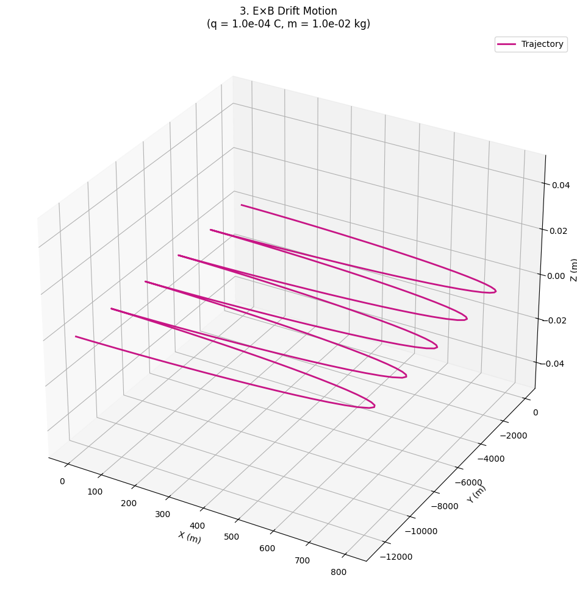

# Problem 1

# Electromagnetism: Lorentz Force Simulations

##  Problem 1: Simulating the Effects of the Lorentz Force

###  Motivation

The **Lorentz force** governs how charged particles behave in electromagnetic fields. It is expressed as:

$$
\mathbf{F} = q\mathbf{E} + q\mathbf{v} \times \mathbf{B}
$$

This law underpins:

- Plasma confinement in fusion reactors
- Particle beams in accelerators
- Mass analysis in spectrometers

Simulations help us visualize and understand the physical phenomena arising from this force.

---

###  Definitions and Key Formulas

- **Lorentz Force**:
  $$
  \mathbf{F} = q (\mathbf{E} + \mathbf{v} \times \mathbf{B})
  $$

- **Newton's Second Law**:
  $$
  \mathbf{F} = m \frac{d\mathbf{v}}{dt}
  $$

- **Cyclotron Frequency**:
  $$
  \omega_c = \frac{qB}{m}
  $$

- **Larmor Radius**:
  $$
  r_L = \frac{mv_\perp}{qB}
  $$

- **Drift Velocity**:
  $$
  \mathbf{v}_d = \frac{\mathbf{E} \times \mathbf{B}}{B^2}
  $$

---

###  Simulation Parameters

To ensure visible, macroscopic-scale trajectories, we use:

- **Charge**: $q = 1\,\text{C}$
- **Mass**: $m = 1\,\text{g} = 0.001\,\text{kg}$

These values prevent tiny subatomic trajectories and enable meaningful visualizations.

---

###  Simulation Scenarios

#### **Scenario 1: Circular Motion in Uniform Magnetic Field**
- $\mathbf{v}_0 \perp \mathbf{B}$
- $\mathbf{E} = 0$

#### **Scenario 2: Spiral Motion (Helix) Along z-axis**
- $\mathbf{v}_0$ has both perpendicular and parallel components to $\mathbf{B}$
- $\mathbf{E} = 0$

#### **Scenario 3: Drift Trajectory in Crossed Fields**
- $\mathbf{E} \perp \mathbf{B}$
- $\mathbf{v}_0 = 0$
- Observe motion with constant **$\mathbf{v}_d = \mathbf{E} \times \mathbf{B} / B^2$**

---

### Scenario 1: Circular Motion

### Scenario 2: Spiral Motion (Helix)

### Scenario 3: Drift Trajectory in Crossed Fields

[COLAB LINK](https://colab.research.google.com/drive/1vvLfP2yA6QJZ0z6O_q7yhNmgcpZKc41d?usp=sharing)