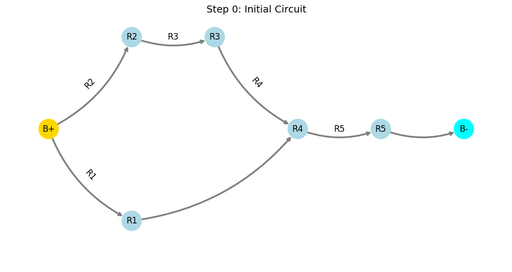
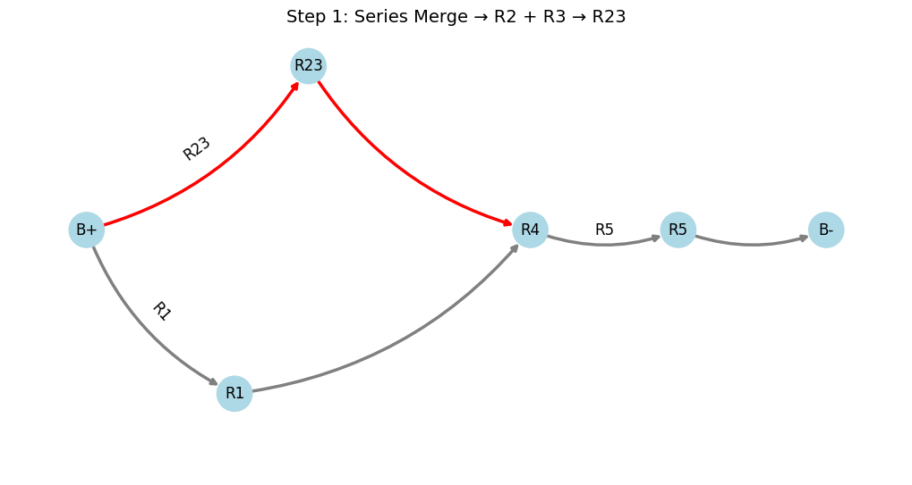
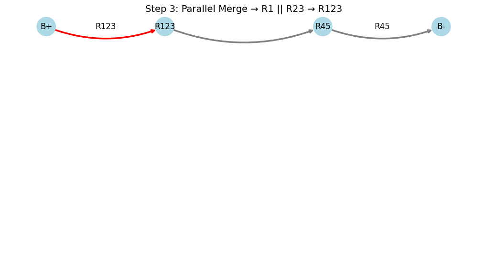
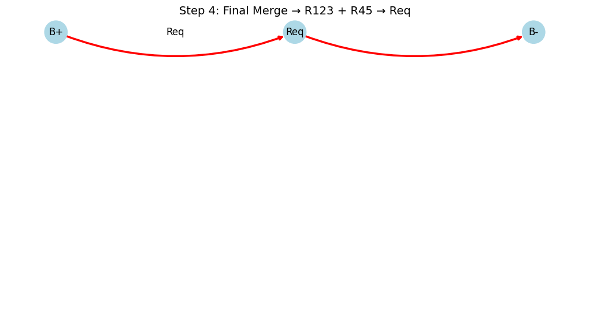

# Problem 1

# Circuit Simplification Using Graph Theory

## Overview

This project demonstrates how to calculate the equivalent resistance of a circuit using **graph theory** and Python’s `NetworkX` library. Circuits are represented as graphs where:

- **Nodes** are junctions.
- **Edges** are resistors with weights representing resistance values in ohms.

Using series and parallel reduction rules, we iteratively simplify complex configurations. This document includes definitions, formulas, examples, implementation code, visualizations (for Google Colab), and setup instructions.

---

## Motivation

Calculating equivalent resistance is essential for analyzing and designing circuits. Traditional methods can be cumbersome for large networks. Graph theory provides:

- A systematic, algorithmic simplification method
- Automation capability
- Cross-disciplinary applicability (EE, Physics, CS)

---

## Definitions

- **Node**: A connection point in the circuit.
- **Edge**: A resistor between two nodes; has a resistance value in ohms ($\Omega$).
- **Series Configuration**: Resistors connected end-to-end (sequential current flow).
- **Parallel Configuration**: Resistors connected between the same two nodes (current splits).
- **Equivalent Resistance**: A single resistor that can replace the original network.
- **Graph**: A `MultiGraph` in NetworkX, supporting multiple edges (parallel resistors).
- **Degree of a Node**: Number of edges incident to a node.

---

## Formulas

- **Series**: For resistors $R_1, R_2, \ldots, R_n$ in series:
  
  $$
  R_{\text{eq}} = R_1 + R_2 + \cdots + R_n
  $$

- **Parallel**: For resistors $R_1, R_2, \ldots, R_n$ in parallel:
  
  $$
  \frac{1}{R_{\text{eq}}} = \frac{1}{R_1} + \frac{1}{R_2} + \cdots + \frac{1}{R_n}
  $$

- **Parallel (two resistors)**:
  
  $$
  R_{\text{eq}} = \frac{R_1 R_2}{R_1 + R_2}
  $$

---

## Examples

### Example 1: Series Circuit

Resistors: $R_1 = 2\,\Omega$, $R_2 = 3\,\Omega$, $R_3 = 5\,\Omega$ between nodes **B+** and **B-**.

**Graph**: `B+ → o1 → o2 → B-`

- Edges: `(B+, o1, 2Ω)`, `(o1, o2, 3Ω)`, `(o2, B-, 5Ω)`

**Simplification**:
1. Combine: $R_1 + R_2 = 5\,\Omega$
2. Then: $5 + R_3 = 10\,\Omega$

**Result**: $R_{\text{eq}} = 10\,\Omega$

---

### Example 2: Parallel Circuit

Resistors: $R_1 = 4\,\Omega$, $R_2 = 6\,\Omega$ between nodes **B+** and **B-**

**Graph**: `B+ ↔ B-` with two edges

**Simplification**:

$$
R_{\text{eq}} = \frac{4 \cdot 6}{4 + 6} = \frac{24}{10} = 2.4\,\Omega
$$

---

### Example 3: Complex Bridge Circuit

Nodes: `B+, o1, o2, o3, B-`

Edges:

- $(B+, o1, 2\,\Omega)$
- $(o1, o2, 3\,\Omega)$
- $(o2, B-, 4\,\Omega)$
- $(B+, o3, 5\,\Omega)$
- $(o3, B-, 6\,\Omega)$
- $(o1, o3, 10\,\Omega)$

This configuration requires iterative reductions.

---

## Algorithm for Equivalent Resistance

We simplify the circuit by applying **series** and **parallel** reductions until only `B+` and `B-` remain connected by a single edge.

### Steps:

**Input**: A `MultiGraph` $G$ with nodes `B+`, `B-`, and edges with a `resistance` attribute.

#### Series Reduction:
- Find a node (e.g., `o2`) with degree 2 (not `B+` or `B-`)
- Let its neighbors be `o1` and `o3` with resistances $R_1$ and $R_2$
- Remove `o2` and its edges
- Add edge `(o1, o3)` with resistance $R_1 + R_2$

#### Parallel Reduction:
- Identify node pairs `(u, v)` with multiple edges
- Compute:

  $$
  R_{\text{eq}} = \left( \sum_{i=1}^n \frac{1}{R_i} \right)^{-1}
  $$

- Replace all parallel edges with one edge of $R_{\text{eq}}$

Repeat until only `B+` and `B-` remain.

---

## Pseudocode

 

###  Understanding Labels in Circuit Simplification

In the process of simplifying resistor networks, we often use temporary labels to represent groups of resistors that have been combined. These labels help us track and visualize each reduction step without redrawing or recalculating the entire network each time.

---

####  `Req`: Equivalent Resistance  
- **Meaning**: Final total resistance of the entire simplified circuit between the battery terminals (e.g., `B+` and `B-`).  
- **When it appears**: At the **final step**, once all other resistors have been combined into a single value.
- **Example**:
  $$ Req = R1 + R2 + R3 \quad \text{(if all in series)} $$

---

####  `Rpar`: Parallel Resistance  
- **Meaning**: Result of combining two or more resistors in **parallel**.  
- **How it's calculated**:
  For two resistors \( R_a \) and \( R_b \) in parallel:
  $$
  \frac{1}{R_{par}} = \frac{1}{R_a} + \frac{1}{R_b}
  $$
- **Used as a new node** in further simplification steps.

---

####  `R12`, `R123`, `R45`, etc.  
- **Meaning**: Resistors that have been combined in **series**.  
- **Naming pattern**:  
  `R12` = result of `R1` + `R2` (in series)  
  `R123` = `R1` + `R2` + `R3`, and so on.
- **Why it's useful**: Keeps track of which resistors have been grouped.

---

###  Battery Terminals: `B+` and `B-`
- Represent the **start** and **end** points of the circuit.
- Connected to the **power supply** in most circuit visualizations.
- All calculations reduce to find total resistance **between** these two points.

---

 These labels are **not physical components**, but simplification aids — like placeholders — so we can follow each step of reduction visually and mathematically.

