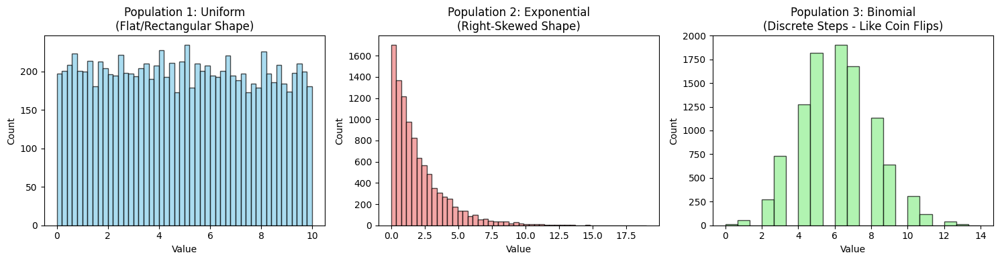
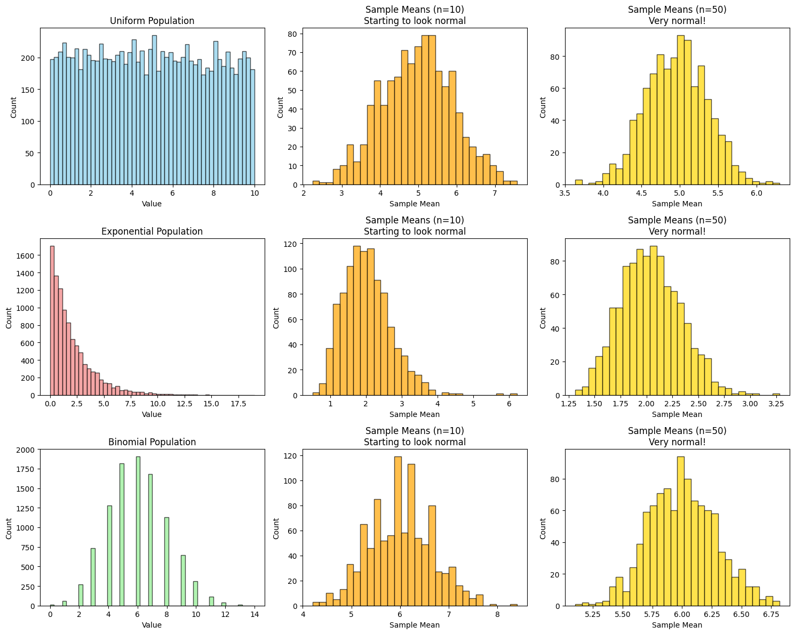

# Problem 1

# Central Limit Theorem — Simulation Study

##  Objective

To **demonstrate** the Central Limit Theorem (CLT) using simulation by:
- Sampling from different distributions.
- Computing sample means.
- Observing the shape of the sampling distribution.

---

##  Theory

###  Central Limit Theorem (CLT)

Let $X_1, X_2, ..., X_n$ be a random sample from a population with mean $\mu$ and variance $\sigma^2$.

Then the standardized sample mean:

$$
Z = \frac{\bar{X} - \mu}{\sigma / \sqrt{n}}
$$

approaches a standard normal distribution $N(0,1)$ as $n \rightarrow \infty$.

---

##  Key Definitions and Formulae

- **Sample Mean**:
  $$
  \bar{X} = \frac{1}{n} \sum_{i=1}^n X_i
  $$

- **Sample Variance**:
  $$
  S^2 = \frac{1}{n-1} \sum_{i=1}^n (X_i - \bar{X})^2
  $$

- **Standard Error (SE)**:
  $$
  \text{SE} = \frac{\sigma}{\sqrt{n}}
  $$

---

##  Simulation Setup

### Step-by-step Plan:
1. Choose distributions:
   - Uniform(0,1)
   - Exponential(λ=1)
   - Binomial(n=10, p=0.5)

2. For each:
   - Generate a **population** of 100,000 values.
   - Take 1000 random samples of size $n = 5, 10, 30, 50$.
   - Calculate the **mean** of each sample.

3. Plot the histograms of these sample means.

---

##  Solution and Observations

We simulated the sampling distribution of sample means from:

-  **Uniform(0,1)**: Flat population; sample means quickly tend toward normality.
-  **Exponential(λ=1)**: Right-skewed; needs larger $n$ to normalize.
-  **Binomial(n=10, p=0.5)**: Discrete distribution; normalizes moderately quickly.

---

## Detailed Results

Below are histograms of sample means for increasing sample sizes:

You can see that:

- As **sample size increases**, the distribution of means **becomes more bell-shaped**.
- This confirms the **CLT**, even when the original data is **not normal**.

---

##  Real-World Implications

- **Polling**: Aggregating public opinion into averages.
- **Quality Control**: Averaging measurements in production.
- **Finance**: Averaging returns in portfolios.

---

[COLAB LINK](https://colab.research.google.com/drive/12R567xVEcxF7KWaeI51MbyVPDudWZxQT#scrollTo=Vpsc_SDlhA7l)