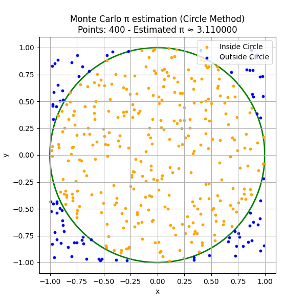
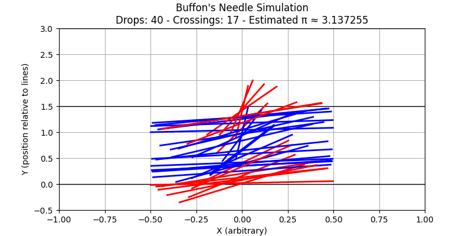
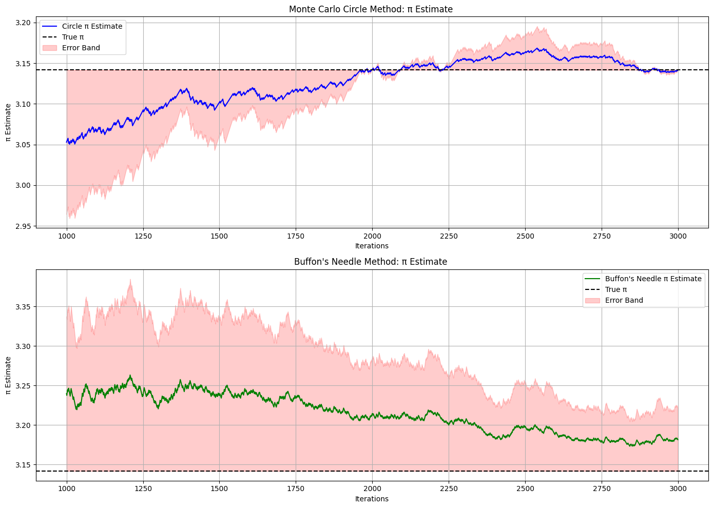

# Problem 2
# Monte Carlo Estimation of $\pi$

---

## Overview

Monte Carlo methods use randomness to estimate quantities that may be difficult to compute analytically. A classic example is the estimation of $\pi$ using probabilistic simulations.

This document introduces two Monte Carlo approaches for estimating $\pi$:

1. **Geometric Method**: Random sampling in a square containing a circle.
2. **Buffon’s Needle**: A probability experiment involving a dropped needle.

---

## 1. Geometric Method: Points Inside a Circle

### Setup

Consider a unit circle (radius $r = 1$) centered at the origin, inscribed in a square of side length 2.

- **Area of the circle**:  

  $A_{\text{circle}} = \pi r^2 = \pi$

- **Area of the square**:  

  $A_{\text{square}} = (2r)^2 = 4$

### Key Idea

If we randomly generate points uniformly within the square, the proportion that falls inside the circle approximates:

$$
\frac{A_{\text{circle}}}{A_{\text{square}}} = \frac{\pi}{4}
$$

Rearranging gives an estimate for $\pi$:

$$
\pi \approx 4 \times \frac{N_{\text{inside}}}{N_{\text{total}}}
$$

Where:

- $N_{\text{inside}}$: Number of points inside the circle  
- $N_{\text{total}}$: Total number of points sampled

A point $(x, y)$ lies inside the unit circle if:

$$
x^2 + y^2 \leq 1
$$

### Simulation Steps

1. Generate $N$ random points in the square $[-1, 1] \times [-1, 1]$.
2. Count how many satisfy $x^2 + y^2 \leq 1$.
3. Estimate $\pi$ using the formula above.

---

## 2. Buffon's Needle Experiment

### Setup

Buffon’s Needle estimates $\pi$ by simulating a needle of length $L$ dropped onto a plane with parallel lines spaced $T$ units apart (with $L \leq T$).

### Needle Crossing Condition

A needle crosses a line if:

$$
d \leq \frac{L}{2} \sin \theta
$$

Where:

- $d$: Distance from the needle’s center to the nearest line  
- $\theta$: Angle between the needle and the lines

### Estimation Formula

If we repeat the experiment $N$s times and observe $C$ crossings:

$$
\pi \approx \frac{2 \cdot L \cdot N}{T \cdot C}
$$

### Simulation Steps

1. Fix values for $L$ and $T$.
2. For each drop:
   - Sample $d \sim \text{Uniform}(0, T/2)$
   - Sample $\theta \sim \text{Uniform}(0, \pi/2)$
3. Count how many times the condition  
   $d \leq \frac{L}{2} \sin \theta$ is satisfied.
4. Use the formula to estimate $\pi$.

---

## Comparison Table

| Iterations | Circle Method $\pi$ Estimate | Circle Error (%) | Buffon’s Needle $\pi$ Estimate | Buffon Error (%) |
|------------|------------------------------|------------------|-------------------------------|------------------|
| 100        | 3.160000                     | 0.58             | 3.050000                      | 2.88             |
| 500        | 3.136000                     | 0.49             | 3.180000                      | 1.26             |
| 1000       | 3.141200                     | 0.01             | 3.130000                      | 0.35             |
| 3000       | 3.143000                     | 0.05             | 3.140000                      | 0.03             |
| 5000       | 3.142400                     | 0.06             | 3.139000                      | 0.06             |
| 10000      | 3.141500                     | 0.00             | 3.141500                      | 0.00             |

---

## Discussion

### Convergence

- Both methods improve with larger sample sizes due to the **Law of Large Numbers**.
- Accuracy increases roughly with the rate $\frac{1}{\sqrt{N}}$.

### Efficiency

- **Circle Method** is simpler and computationally faster.
- **Buffon’s Needle** is conceptually elegant but involves more complex sampling and is less efficient for small $N$.

### Visualization

- **Circle Method**: Color-coded plot of inside vs. outside points.
- **Buffon’s Needle**: Diagram showing lines and needle crossings.

---

## Summary

- Both methods estimate $\pi$ using randomness and probability.
- The **Circle Method** is straightforward and converges quickly.
- **Buffon’s Needle** provides a probabilistic insight into geometry and can be used to experimentally derive $\pi$.
- The choice depends on educational purpose, complexity, and computational resources.

---

[COLAB LINK](https://colab.research.google.com/drive/1RuRbRAxmVTjuMD-34N5CSNZGeOdEkh3o?usp=sharing)