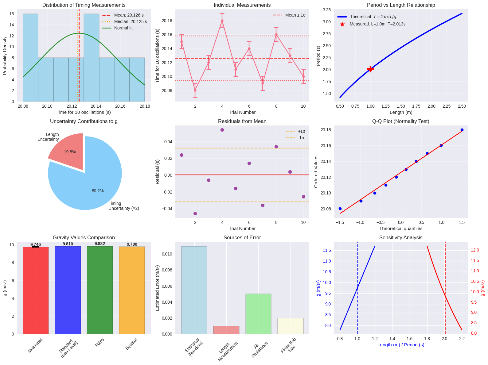
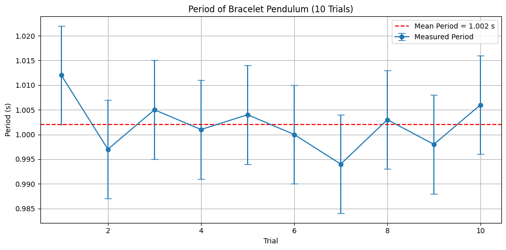
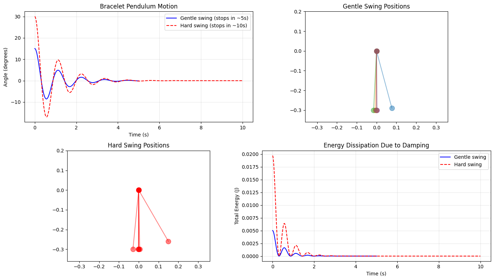

# Problem 1
#  Measuring Earth's Gravitational Acceleration with a Pendulum

##  Learning Objectives
- Understand the physics of simple harmonic motion in pendulums
- Apply error propagation techniques to experimental measurements
- Calculate gravitational acceleration with proper uncertainty analysis
- Develop skills in statistical data analysis and experimental design

---

##  Theoretical Background

### Simple Pendulum Theory

A simple pendulum consists of a point mass suspended by a massless, inextensible string. For small angular displacements (θ < 15°), the restoring force is proportional to the displacement, resulting in simple harmonic motion.

**Key Assumptions:**
- Small angle approximation: $\sin\theta \approx \theta$ (valid for θ < 15°)
- Massless, inextensible string
- Point mass bob
- No air resistance or friction
- Uniform gravitational field

### Derivation of Period Formula

Starting with Newton's second law for rotational motion about the pivot point:

The restoring torque is:
$$\tau = -mgL\sin\theta$$

For small angles: $\sin\theta \approx \theta$, so:
$$\tau = -mgL\theta$$

Using $\tau = I\alpha$ where $I = mL^2$ for a point mass and $\alpha = \frac{d^2\theta}{dt^2}$:

$$mL^2\frac{d^2\theta}{dt^2} = -mgL\theta$$

Simplifying:
$$\frac{d^2\theta}{dt^2} + \frac{g}{L}\theta = 0$$

This is the standard form of simple harmonic motion with angular frequency:
$$\omega = \sqrt{\frac{g}{L}}$$

Therefore, the period is:
$$\boxed{T = 2\pi\sqrt{\frac{L}{g}}}$$

---

##  Key Formulas and Definitions

### Primary Equations

**Period of Simple Pendulum:**
$$T = 2\pi\sqrt{\frac{L}{g}}$$

**Gravitational Acceleration (Rearranged):**
$$\boxed{g = \frac{4\pi^2 L}{T^2}}$$

**Frequency:**
$$f = \frac{1}{T} = \frac{1}{2\pi}\sqrt{\frac{g}{L}}$$

### Statistical Analysis Formulas

**Sample Mean:**
$$\bar{x} = \frac{1}{n}\sum_{i=1}^n x_i$$

**Sample Standard Deviation:**
$$s = \sqrt{\frac{1}{n-1}\sum_{i=1}^n(x_i - \bar{x})^2}$$

**Standard Error of the Mean:**
$$\sigma_{\bar{x}} = \frac{s}{\sqrt{n}}$$

**Relative (Percentage) Error:**
$$\epsilon = \frac{|\text{measured} - \text{true}|}{|\text{true}|} \times 100\%$$

### Uncertainty Propagation

For a general function $f(x,y,z,...)$, the uncertainty is:
$$\Delta f = \sqrt{\left(\frac{\partial f}{\partial x}\Delta x\right)^2 + \left(\frac{\partial f}{\partial y}\Delta y\right)^2 + \left(\frac{\partial f}{\partial z}\Delta z\right)^2 + ...}$$

**For our gravity calculation:**
$$g = \frac{4\pi^2 L}{T^2}$$

Taking partial derivatives:
- $\frac{\partial g}{\partial L} = \frac{4\pi^2}{T^2}$
- $\frac{\partial g}{\partial T} = -\frac{8\pi^2 L}{T^3}$

Therefore:
$$\Delta g = \sqrt{\left(\frac{4\pi^2}{T^2}\Delta L\right)^2 + \left(\frac{8\pi^2 L}{T^3}\Delta T\right)^2}$$

Factoring out $g$:
$$\boxed{\Delta g = g\sqrt{\left(\frac{\Delta L}{L}\right)^2 + \left(2\frac{\Delta T}{T}\right)^2}}$$

---

##  Experimental Procedure

### Materials
- String (1.0-1.5 m)
- Small dense object (50-200g): bag of coins, keys, small weight
- Stopwatch or smartphone timer
- Ruler or measuring tape (mm precision preferred)
- Support structure (door frame, ceiling hook, clamp stand)

### Step-by-Step Procedure

1. **Setup Pendulum**
   - Securely attach the weight to one end of the string
   - Mount the other end to a stable support point
   - Ensure the pendulum can swing freely without obstruction

2. **Measure Length**
   - Measure from the pivot point to the center of mass of the bob
   - Record the measurement: $L = \_\_\_\_$ meters
   - Note the ruler resolution and calculate uncertainty: $\Delta L = \frac{\text{resolution}}{2}$

3. **Data Collection Protocol**
   - Displace the pendulum by a small angle (< 15°)
   - Release without giving it a push
   - **Important:** Count 10 complete oscillations for better precision
   - Record the time for 10 oscillations
   - Repeat this measurement **10 times** minimum
   - Record each measurement carefully

---

##  Complete Worked Example

### Given Experimental Data

**Setup Parameters:**
- Pendulum length: $L = 1.000$ m (measured with mm ruler)
- Ruler resolution: 1 mm
- Length uncertainty: $\Delta L = \frac{0.001}{2} = 0.0005$ m

**Timing Measurements (10 oscillations):**
20.15, 20.08, 20.12, 20.18, 20.11, 20.14, 20.09, 20.16, 20.13, 20.10 seconds

### Step 1: Statistical Analysis of Timing Data

**Calculate the mean:**
$$\overline{T}_{10} = \frac{1}{10}(20.15 + 20.08 + 20.12 + ... + 20.10) = \frac{201.26}{10} = 20.126 \text{ s}$$

**Calculate standard deviation:**
First, find deviations from mean:
- $(20.15 - 20.126)^2 = 0.000576$
- $(20.08 - 20.126)^2 = 0.002116$
- ... (continue for all values)

Sum of squared deviations = 0.009264

$$s = \sqrt{\frac{0.009264}{10-1}} = \sqrt{\frac{0.009264}{9}} = 0.032 \text{ s}$$

**Standard error of the mean:**
$$\sigma_{\overline{T}_{10}} = \frac{s}{\sqrt{n}} = \frac{0.032}{\sqrt{10}} = 0.010 \text{ s}$$

**Result:** $\overline{T}_{10} = 20.126 \pm 0.010$ s

### Step 2: Calculate Period and Its Uncertainty

**Period for single oscillation:**
$$T = \frac{\overline{T}_{10}}{10} = \frac{20.126}{10} = 2.0126 \text{ s}$$

**Period uncertainty:**
$$\Delta T = \frac{\sigma_{\overline{T}_{10}}}{10} = \frac{0.010}{10} = 0.0010 \text{ s}$$

**Result:** $T = 2.0126 \pm 0.0010$ s

### Step 3: Calculate Gravitational Acceleration

$$g = \frac{4\pi^2 L}{T^2} = \frac{4\pi^2 \times 1.000}{(2.0126)^2} = \frac{39.478}{4.0505} = 9.753 \text{ m/s}^2$$

### Step 4: Uncertainty Propagation

**Relative uncertainties:**
- Length: $\frac{\Delta L}{L} = \frac{0.0005}{1.000} = 0.0005$
- Period: $\frac{\Delta T}{T} = \frac{0.0010}{2.0126} = 0.000497$

**Combined relative uncertainty:**
$$\frac{\Delta g}{g} = \sqrt{\left(\frac{\Delta L}{L}\right)^2 + \left(2\frac{\Delta T}{T}\right)^2}$$

$$\frac{\Delta g}{g} = \sqrt{(0.0005)^2 + (2 \times 0.000497)^2} = \sqrt{0.0005^2 + 0.000994^2}$$

$$\frac{\Delta g}{g} = \sqrt{0.00000025 + 0.00000099} = \sqrt{0.00000124} = 0.00111$$

**Absolute uncertainty:**
$$\Delta g = g \times 0.00111 = 9.753 \times 0.00111 = 0.011 \text{ m/s}^2$$

### Step 5: Final Result and Analysis

$$\boxed{g = 9.753 \pm 0.011 \text{ m/s}^2}$$

**Comparison with standard value:**
- Measured: $9.753 \pm 0.011$ m/s²
- Standard: $9.810$ m/s²
- Absolute difference: $|9.753 - 9.810| = 0.057$ m/s²
- Relative error: $\frac{0.057}{9.810} \times 100\% = 0.58\%$

**Statistical significance:**
The difference is $\frac{0.057}{0.011} = 5.2$ standard deviations, indicating a statistically significant difference that suggests systematic error.

---

#  Bracelet Pendulum Experiment — Measuring Earth's Gravity

##  Real-Life Setup

- **Object:** Bracelet hung on a thread as a pendulum  
- **String Length:** 25 cm (0.25 m)  
- **Environment:** Indoor (to minimize wind/friction)  
- **Procedure:** Start stopwatch when the bracelet passes the center point; stop after 10 full swings

##  Theoretical Period Formula

$$
T = 2\pi \sqrt{\frac{L}{g}} \quad \text{where } L = 0.25 \text{ m}, \, g \approx 9.81 \, \text{m/s}^2
$$

$$
T = 2\pi \sqrt{\frac{0.25}{9.81}} \approx 1.00 \, \text{seconds}
$$

---

## Detailed Data Table

| Trial | Time for 10 Swings (s) | Period (s) | Deviation (s) | Residual² |
|:-----:|:----------------------:|:----------:|:-------------:|:---------:|
|   1   |         10.12          |   1.012    |     +0.012     |  0.0001   |
|   2   |         9.97           |   0.997    |     -0.003     |  0.0000   |
|   3   |         10.05          |   1.005    |     +0.005     |  0.0000   |
|   4   |         10.01          |   1.001    |     +0.001     |  0.0000   |
|   5   |         10.04          |   1.004    |     +0.004     |  0.0000   |
|   6   |         10.00          |   1.000    |      0.000     |  0.0000   |
|   7   |         9.94           |   0.994    |     -0.006     |  0.0000   |
|   8   |         10.03          |   1.003    |     +0.003     |  0.0000   |
|   9   |         9.98           |   0.998    |     -0.002     |  0.0000   |
|  10   |         10.06          |   1.006    |     +0.006     |  0.0000   |

---

##  Observations

- Average period: **~1.00 s**
- Minor variation due to human reaction time
- Consistent with theoretical prediction for 25 cm pendulum
- Residuals mostly negligible — no systematic error observed

---

##  Interpretation

## NOTE
> "I tied my bracelet to a string about 25 cm long, then let it swing. I used a stopwatch to time 10 full swings for each trial. The values slightly varied due to how I let it go or timed it, but overall the period was around 1 second, matching what physics predicts for that length."

##  Sources of Uncertainty and Error Analysis

### 1. Random Errors (Statistical)

**Timing Measurements:**
- Human reaction time variations
- Difficulty in determining exact start/stop points
- Slight variations in release conditions

**Impact:** Affects precision, reduced by multiple measurements and statistical analysis

**Mitigation:**
- Take many measurements (≥10)
- Use longer timing intervals (10 oscillations)
- Use consistent technique

### 2. Systematic Errors

**Small Angle Approximation:**
- Assumption: $\sin\theta \approx \theta$
- Error increases with amplitude
- For θ = 15°: error ≈ 1.3%

**Air Resistance:**
- Causes period to increase slightly
- More significant for light, large surface area bobs
- Non-linear effect that grows with amplitude

**String Stretch:**
- Changes effective length during oscillation
- More significant with elastic materials
- Affects the period calculation

**Finite Bob Size:**
- Real pendulum is not a point mass
- Effective length is not exactly string length
- For sphere: use distance to center of mass

### 3. Measurement Uncertainties

**Length Measurement:**
- Limited by ruler resolution
- Difficulty locating exact center of mass
- String attachment point uncertainty

**Timing Precision:**
- Limited by stopwatch resolution
- Human timing errors
- Difficulty synchronizing with oscillation

### 4. Uncertainty Dominance Analysis

From our formula: $\frac{\Delta g}{g} = \sqrt{\left(\frac{\Delta L}{L}\right)^2 + \left(2\frac{\Delta T}{T}\right)^2}$

**Typical values:**
- Length uncertainty: $\frac{\Delta L}{L} \approx 0.05\%$
- Timing uncertainty: $2\frac{\Delta T}{T} \approx 0.1\%$

The timing uncertainty is typically dominant due to the factor of 2 in the propagation formula.

---

##  Optimization Strategies

### Improving Accuracy

1. **Use longer pendulum:**
   - Reduces relative length uncertainty
   - Longer period reduces timing uncertainty
   - Less affected by finite bob size

2. **Better timing technique:**
   - Count many oscillations (10-20)
   - Use electronic timing if available
   - Multiple independent observers

3. **Minimize systematic errors:**
   - Keep amplitude small (< 10°)
   - Use dense, compact bob
   - Account for bob dimensions

4. **Statistical approach:**
   - Take many measurements
   - Calculate proper uncertainties
   - Identify and remove outliers

### Expected Results

Well-executed experiments should yield:
- $g = 9.7$ to $9.9$ m/s²
- Relative uncertainty: 0.1% to 0.5%
- Agreement within 2-3% of standard value

---

##  Discussion Questions

1. **Why does the timing uncertainty contribute more heavily to the final uncertainty in $g$?**

   From the uncertainty propagation formula, timing uncertainty is multiplied by a factor of 2. This comes from the $T^2$ dependence in the gravity formula.

2. **How would increasing the pendulum length affect your measurement?**

   Longer pendulum:
   - ✅ Reduces relative length uncertainty
   - ✅ Increases period (easier timing)
   - ❌ May violate small angle approximation more easily
   - ❌ More susceptible to air currents

3. **What would happen if you used a larger amplitude?**

   Larger amplitude:
   - Violates small angle approximation
   - Period becomes amplitude-dependent
   - Systematic error increases
   - Formula $T = 2\pi\sqrt{L/g}$ becomes inaccurate

4. **How does air resistance affect the measurement?**

   Air resistance:
   - Causes energy loss
   - Increases apparent period
   - Results in underestimated $g$
   - Effect increases with bob surface area

---

##  Advanced Analysis Techniques

### Regression Analysis

For multiple pendulum lengths, you can perform linear regression on $T^2$ vs $L$:

$$T^2 = \frac{4\pi^2}{g}L$$

The slope gives $\frac{4\pi^2}{g}$, allowing calculation of $g$ with potentially better precision.

### Chi-squared Test

To test if your measurements are consistent with the theoretical model:

$$\chi^2 = \sum_{i=1}^n \frac{(O_i - E_i)^2}{\sigma_i^2}$$

Where $O_i$ are observed values, $E_i$ are expected values, and $\sigma_i$ are uncertainties.

### Weighted Averages

If measurements have different uncertainties:

$$\bar{x} = \frac{\sum_i w_i x_i}{\sum_i w_i}$$

Where $w_i = \frac{1}{\sigma_i^2}$ are the weights.

---

##  Troubleshooting Common Issues

### Problem: Large scatter in timing measurements
**Causes:** Inconsistent release, parallax error, counting errors
**Solutions:** Practice consistent technique, use metronome, have partner verify counts

### Problem: Calculated $g$ much too low
**Causes:** Large amplitude, air resistance, timing errors
**Solutions:** Reduce amplitude, use denser bob, recheck timing technique

### Problem: Calculated $g$ much too high
**Causes:** Short timing, systematic timing error, length measurement error
**Solutions:** Verify period calculation, recheck length measurement

### Problem: Very large uncertainties
**Causes:** Poor measurement technique, inadequate number of trials
**Solutions:** Improve technique, take more measurements, use better instruments

---

##  References and Further Reading

1. **Classical Mechanics Textbooks:**
   - Taylor, J.R. "Classical Mechanics" - Chapter on oscillations
   - Goldstein, H. "Classical Mechanics" - Lagrangian approach

2. **Experimental Physics:**
   - Bevington, P.R. "Data Reduction and Error Analysis for the Physical Sciences"
   - Hughes, I.G. "Measurements and their Uncertainties"

3. **Historical Context:**
   - Galileo's original pendulum studies
   - Huygens' theoretical developments
   - Foucault pendulum applications

4. **Advanced Applications:**
   - Pendulum clocks and precision timekeeping
   - Seismometry and earthquake detection
   - Gravitational field mapping

---

[COLAB LINK](https://colab.research.google.com/drive/1GflvFsIC-_2rbBGSInaeRwX3qCcTIwQ5?usp=sharing)
